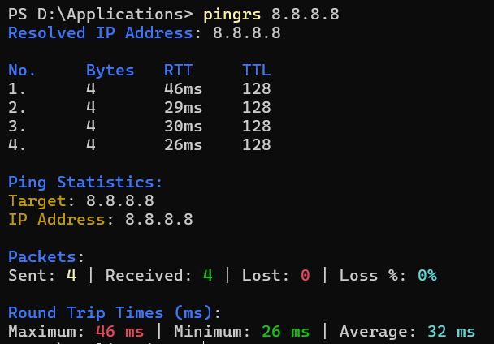

# `pingrs`

[](https://crates.io/crates/pingrs)

`pingrs` is a ping utility written in RUST for **Windows** and **Linux** systems with coloured output and statistics. The ping requests are sent at a time delay of 1 second from the previous. RTT and Packet size are recorded and display is easy to read output.

**NOTE**: `pingrs` works in **Windows** and **Linux** systems only. The support for sockets for pinging in **MacOS** has not been established in `pingrs`.



## Installation
Please refer to the releases section for the below mentioned files.

### With `cargo`

The version v0.1.0 of `pingrs` is now available in the [crates.io](https://crates.io/crates/pingrs). You can install `pingrs` with the command 
```bash
cargo install pingrs
```

<!-- ### For Arch Linux (x86_64) Systems

The version v0.1.0 of `pingrs` is now available in the [Arch User Repository](https://aur.archlinux.org/packages/btrls). You can install `pingrs` with the command 
```bash
yay -S pingrs
``` -->

### For Windows Systems
If you are on a Windows Machine, you can download the `pingrs-v0.1.0.exe` executable file and add the location of the downloaded application to the System or User Environment Variables.

### Compiling from source

And you can also compile the application from source by either downloading an archive or cloning the repository then building the application with `cargo`. In the root directory of the repository, run

```bash
cargo build --release
```

Then the path of the binary, present at `./target/release/pingrs[.exe]`, can be added to `PATH` environment variable.

## Usage
```bash
pingrs [OPTIONS] [TARGET]
```

## Arguments:
```bash
[TARGET]
```
- `TARGET` -> The Target domain or IP Address to which ping request will be sent.

## Options

### Setting Timeout for Packets
```bash
-t, --timeout <TIMEOUT_SECS>
```
`TIMEOUT_SECS` -> Number of seconds before timeout

### Pinging Infinitely
```bash
-i, --infinite
```

### Set number of times to send ping request
```bash
-n, --n-times <NO_OF_TIMES>
```
`NO_OF_TIMES` -> Number of times to ping

### Setting Time-To-Live for packets
```bash
-T, --ttl <TTL>
```
`TTL` -> Time-To-Live for a ping request (Max: 255)

### Printing Help
```bash
-h, --help
```
### Printing Version
```bash
-V, --version
```

---

For any issues encounterd in `pingrs` please post a Github issue in the repository.

Thank You!!